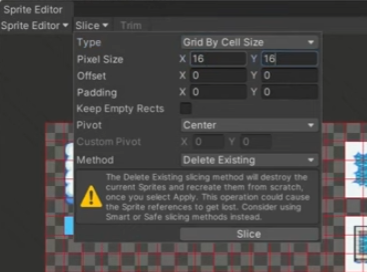
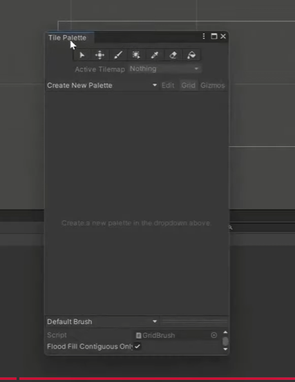
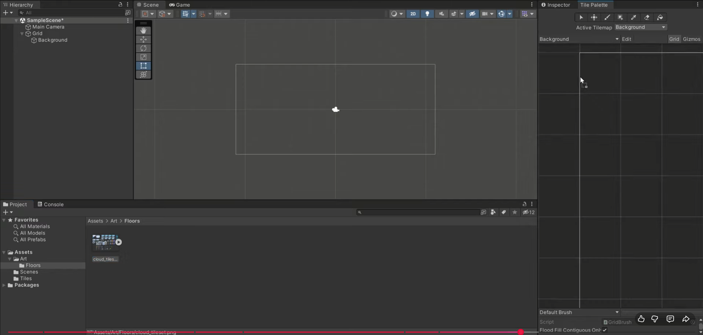
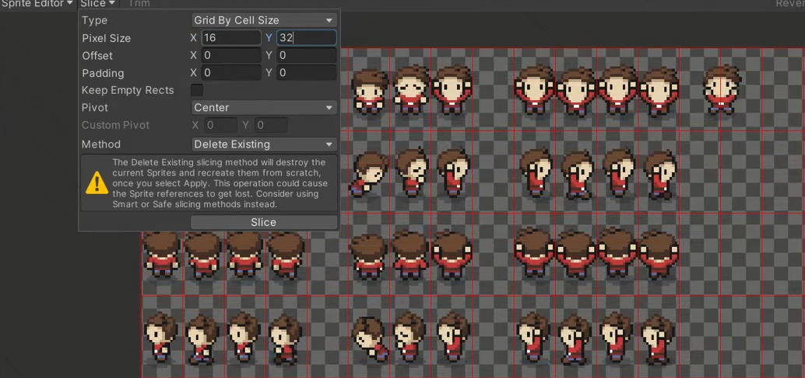

# Documentacion proyecto Cepeda

### Unity version: 6-3 LTS (6000.3.0f1)

## Tipo de escena

La escena es 3D pero para acceder a todas las caracteristicas en 2d del motor si no las ofrece de primeras clickar: window --> Package Management --> Package Management y dentro de la ventana que se abre instalar todo lo relacionado con el 2D. Despues reabrir el proyecto si es necesario.

## Sprites(Fondo, personajes y animaciones)

Toda la parte grafica en 2d estara gestionada en Sprite haciendo uso de Sprite renderer para los personajes y tileMaps para l# escenarios. Es necesario tener un TileSet que no es mas que un png con todos los sprites que se quieran usar, puede ser para un personaje con sus animaciones o un escenario con todos su bloques. En itchio hay muchos samples gratis. Los que estoy usando de momento son:
* Para los fondos: https://finalbossblues.itch.io/cloud-city-tileset
* Para el player: https://github.com/kiyama14/tutorial-art

## Fondo

Dentro de la carpeta de los fondos hay un png llamado tile_set con un monton de sprites de fondos, arrastramos esa imagen a asests de nuestro proyecto en una carpeta o lo que quieras.
Al clicar el tileset se nos abrira el inspectgor y es necesario hacer los siguiente cambios:
* Sprite MOde: Multiple
* Pixels Per Unit: 16
* Filtrer Mode: Point(No Filter)
* Compression: None
Inportante clicar en apply despues de los cambios.
En el inspector veremos un boton llamado Sprite Editor, es con lo que vamos a separar la imagen en pequeños sprites del tamaño deseado, en este caso como es para un fondo los cortaremos como cuadrado al tamaño de cada "cuadrito".
Al abrir el editor clicar en Slice arriba a la izquierda y en Type cambiar a Grid by Cell Size y en pixel size el eje x en 16 y el eje y en 16 y clicar el boton Slice y Aply.



Veremos que nuestro png se ha separado en bloques individuales.

Para enpezar a pintar el fondo debemos de crear un: 2D Object ---> TileMap ---> Rectangular

Se nos creara un grid y nuestro fondo dentro del grid que lo llamaremos background o nonCollisionLow.
Para enpezar a pintar necesitamos una Tile Palete que es una ventanita, para sacarla vamos a: Window ---> 2D ---> Tile Palete.

Se nos abrira esta ventana:



Clicamos en Create New Palete le asignamos el nombre(background) y clicamos en create, pedira un folder, lo mejor es crear una carpeta en Assets la llamamos Tiles y lo selecionamos.

Seleccionamos el tileSet que teniamos previamente sliceado y lo arrastramos a la Tile Palete





Nos pedira un folder, seleccionaremos el folder llamado Tiles que creamos antes.
Una vez hecho ya tenemos todas las herramientas necesarias para pintar el backGround

## Player(Sprite y movimiento)


Incluire el movimiento tambien por que es muy simple.

Para el sprite del player hay que hacer lo mismo que con el backGround, pero es preferible hacerlo en una carpeta llamada player o lo que sea por orden.
Una vez hecho las mismas configuraciones que con el png de background vamos al sprite editor con la diferencia de que en vez de darle 16 de pixel size en el eje y le darenmos 32 que es el doble, esto es por que el personaje es el doble de alto que de ancho por lo tanto ya no es cuadrado.




Una vez sliceado arrastramos uno spritye del personaje cualquiera a la escena. Este va a ser nuestro player y le asignaremos un Script de movimiento. El script es el siguiente

```
 using System;
    using System.Collections;
    using System.Collections.Generic;
    using Unity.Mathematics;
    using UnityEngine;
    using UnityEngine.InputSystem;

    public class movimiento : MonoBehaviour
    {
        [SerializeField] private float speed = 5f;
        [SerializeField] private Rigidbody2D rb;
        [SerializeField] private Animator animator;

        private Vector2 input;

        void Awake()
        {
            if (rb == null)
            {
                rb = GetComponent<Rigidbody2D>();
            }
        }

        void Update()
        {
            // Reset input
            input = Vector2.zero;

            if (Keyboard.current != null)
            {
                if (Keyboard.current.wKey.isPressed || Keyboard.current.upArrowKey.isPressed)
                    input.y += 1f;

                if (Keyboard.current.sKey.isPressed || Keyboard.current.downArrowKey.isPressed)
                    input.y -= 1f;

                if (Keyboard.current.aKey.isPressed || Keyboard.current.leftArrowKey.isPressed)
                    input.x -= 1f;

                if (Keyboard.current.dKey.isPressed || Keyboard.current.rightArrowKey.isPressed)
                    input.x += 1f;
            }

            // Normalizar para que no se mueva más rápido en diagonal
            input = input.normalized;


        void FixedUpdate()
        {
            // Movimiento con Rigidbody2D
           
                rb.MovePosition(rb.position + input * speed * Time.fixedDeltaTime);                
            
        }        

    }
```

el primer if no es mas que un key.Input pero para unity 6, se normaliza el movimiento y se aplica atraves de un rigid body que tendremos que agregar previamente al sprite del player, ademas de un box Colider 2D. Es inportante el uso del rigidBody pues luego nos ayudara con las colisiones en general.


## Player(Animaciones)

Para animar al personaje primero crearemos las distintas animaciones y despues le diremos por codigo cunado usarlas.

### Crear las animaciones
Haremos 4 para mirar en todas las direcciones que seran solo para cambiar de direccion y otras 4 que seran las 4 direcciones pero andando en vez de parado.

Para sacar el animador vamos a: Window ---> Animation ---> Animation

Clicamos en create para crear nuestra primera animacion. Nos pedira un folder, creamos uno llamado animations y llamamos a nuestra animacion left(por ejemplo)
Arrastramos el sprite de nuestro personaje mirando quieto a la izquierda, al pulsar play veras si funciona. Deberia de mirar a la izquierda.
Clicamos en la flechita hacia bajo donde pone left y le damos a Create New Clip y creamos el siguiente clip haciendo lo mismo que con el anterior pero con una nueva direccion.
Ahora crearemos las 4 de caminar, seguimos los mismos pasos, creamos un nuevo clip (walkLeft por ejemplo) pero ahora tendremos que arrastrar los cuatro sprites de andar y los ponemos en este orden: parado, andando pie derecho, parado, andando pie izquiero. Yo decidi ponerle al final otro de parado por que si no se me bugueaba la animacion, ajustamos cada sprite en la time line para que esten a la misma distancia y estiramos el conjunto para que dure lo que queramos, yo lo deje en 1 segundo.
Hacemos lo mismo con cada direccion hasta que tengamos las cuatro animaciones de andar.


